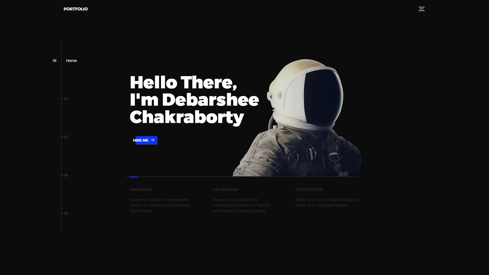
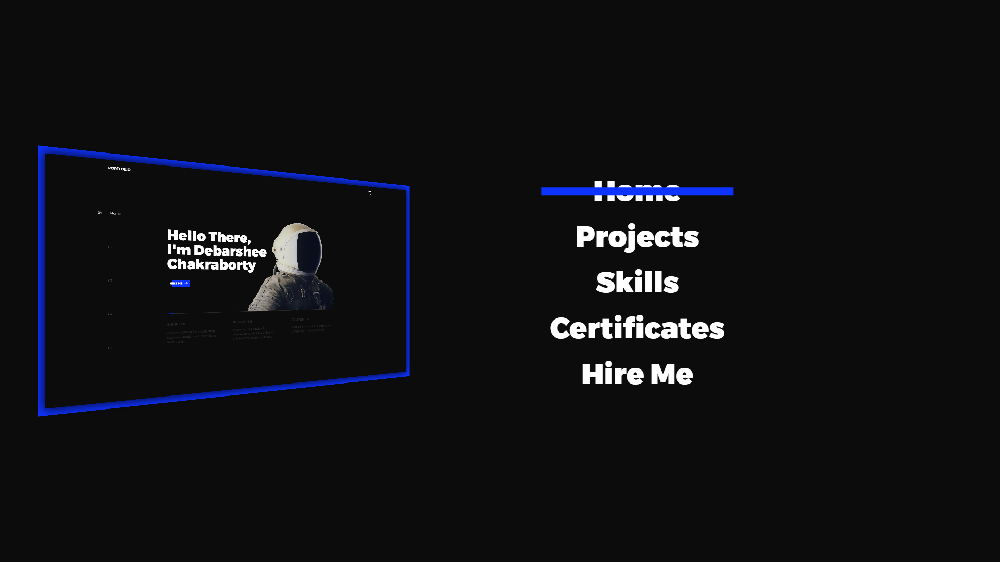
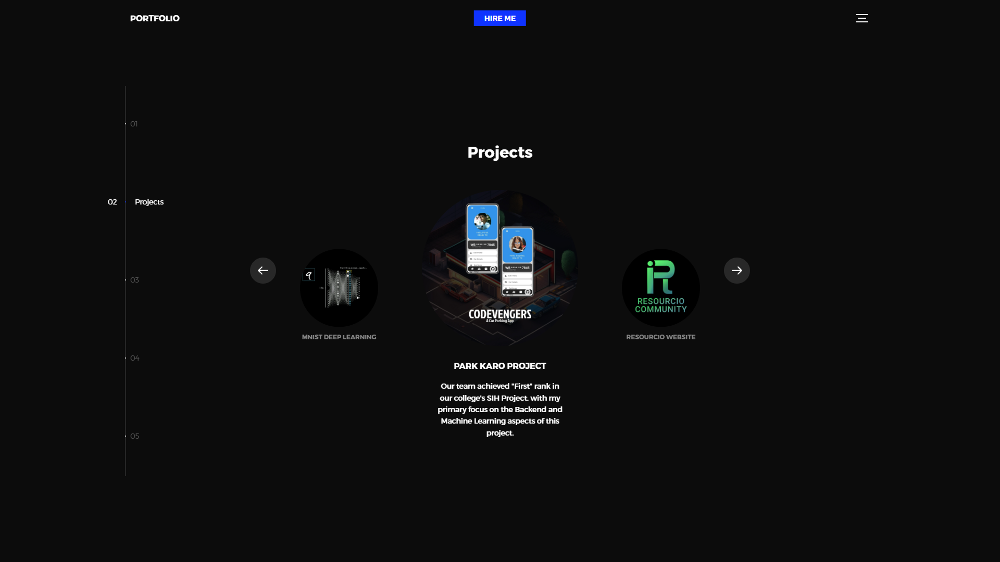
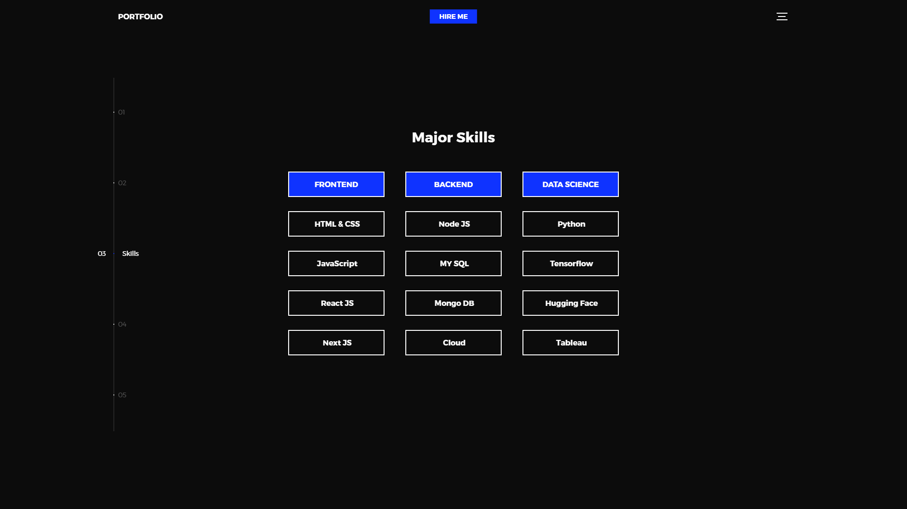
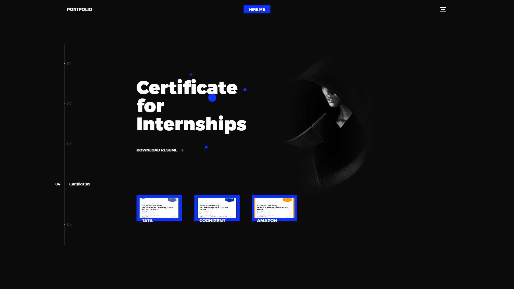

# Portfolio-Website

Portfolio-Website is a repository that houses my personal portfolio website, which showcases my skills, projects, and achievements. The website serves as a professional introduction and provides visitors with an overview of my work and experience in the field of web development.

## Screenshots

## Website Preview and Speciality

🚀 Check out the live website: [debarshee.netlify.app](https://debarshee.netlify.app/)

The portfolio website has several features and highlights:

1. **Responsive Design**: The website is built with a responsive design, ensuring a seamless and optimal viewing experience across different devices, including desktops, tablets, and mobile phones.

2. **Portfolio Showcase**: The website showcases my projects, skills, and achievements in an organized and visually appealing manner. Visitors can explore different sections to get a comprehensive understanding of my capabilities.

3. **Project Details**: Each project listed on the website provides a brief description, technologies used, and a link to the live project or its repository. This allows visitors to delve deeper into specific projects of interest.

4. **Skills and Expertise**: The portfolio website highlights my skills and areas of expertise in web development. Visitors can gain insights into the technologies, programming languages, frameworks, and tools that I am proficient in.

5. **Resume and Contact Information**: The website provides a link to my resume for easy access. Additionally, visitors can find my contact information, allowing them to get in touch if they have any inquiries or opportunities.

## Technologies Used

The Portfolio-Website utilizes the following technologies:

- **HTML**: The standard markup language for creating web pages.
- **CSS**: The stylesheet language used for describing the presentation of a document written in HTML.
- **JavaScript**: A programming language that enables dynamic and interactive web page functionality.

## Contributing

Contributions to the Portfolio-Website repository are welcome! If you have suggestions, improvements, or spot any issues, please open an issue on the [GitHub repository](https://github.com/debarshee2004/Portfolio-Website/issues). You can also submit a pull request with your changes if you would like to contribute code.

When contributing to this project, please ensure you follow the [code of conduct](CODE_OF_CONDUCT.md).

## License

The Portfolio-Website repository is open source and is licensed under the [MIT License](LICENSE).

## Contact

If you have any questions or need further assistance, please feel free to contact me:

- Debarshee Chakraborty
- Email: [debarsheechakraborty.11d@gmail.com](mailto:debarsheechakraborty.11d@gmail.com)
- GitHub: [debarshee2004](https://github.com/debarshee2004)

Feel free to explore the Portfolio-Website repository and get inspired to create your own personalized portfolio website!
